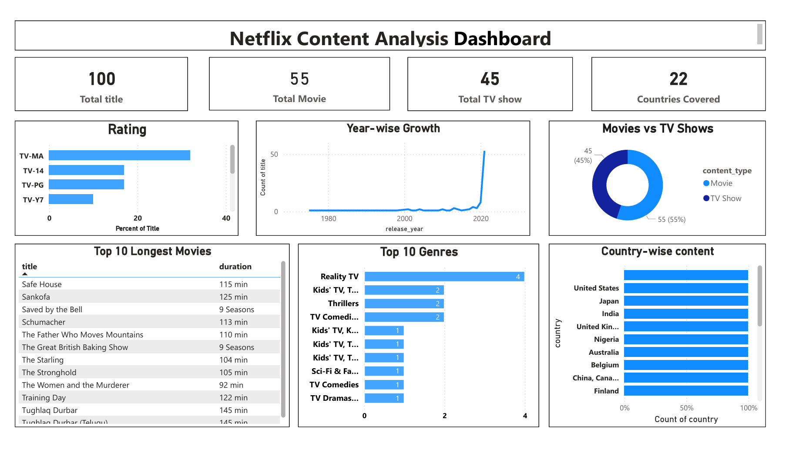

Netflix Content Analysis Dashboard

Project Overview
This project analyzes Netflix movies and TV shows using MySQL Workbench and Power BI to uncover trends, patterns, and insights in streaming content. The goal is to transform raw data into meaningful visual insights through an interactive dashboard.

 Project Objective
- Clean and prepare the Netflix dataset using SQL
- Perform exploratory data analysis
- Identify trends in content distribution
- Build an interactive Power BI dashboard
- Present insights visually for decision-making

Tools & Technologies
This project was built using:
- MySQL Workbench - data cleaning and SQL analysis
- Power BI Desktop - dashboard design and visualization

Dataset Source
Netflix Movies & TV Shows dataset from Kaggle.  
The dataset includes titles, genres, countries, release years, ratings, and duration.

Data Cleaning Steps
- Handled missing values in key columns
- Standardized text fields
- Trimmed extra spaces
- Converted date formats
- Verified null and empty values

 Dashboard Highlights
The dashboard includes summary cards displaying:
- Total number of Netflix titles
- Total Movies
- Total TV Shows
- Number of countries covered

Additional visuals include:
- Movies vs TV Shows distribution
- Top genres analysis
- Country-wise content comparison
- Year-wise growth trends
- Ratings breakdown

Key Insights
- Netflix contains more movies than TV shows
- Drama and international content dominate the catalog
- The USA produces the highest number of titles
- Content growth accelerated after 2015
- Most titles are rated TV-MA and TV-14

Dashboard Preview

 Conclusion
This project demonstrates practical skills in SQL data cleaning, analysis, and Power BI dashboard development. It highlights the ability to transform raw datasets into actionable insights — a key skill for data analysts.

Author
Nirjala Yadav
